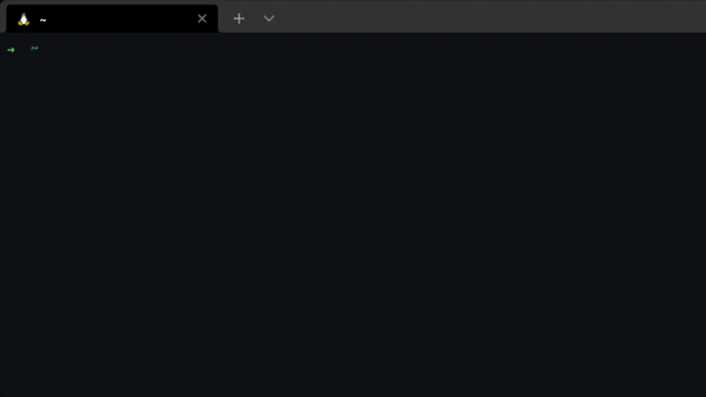

# Crypto Monitor

A simple crypto coins monitor for your terminal.


</br>

## How to Install

  ```shell
    $ npm i -g @tunadao1/crypto-monitor
  ```

## How to use

  ```shell
    crypto-monitor watch <LIST OF COINS ID> -curr <CURRENCY>
  ```

Example:

  ```shell
    crypto-monitor watch bitcoin,ethereum -curr BRL
  ```

[List of coins ID](https://docs.google.com/spreadsheets/d/1wTTuxXt8n9q7C4NDXqQpI3wpKu1_5bGVmP9Xz0XGSyU/edit#gid=0)